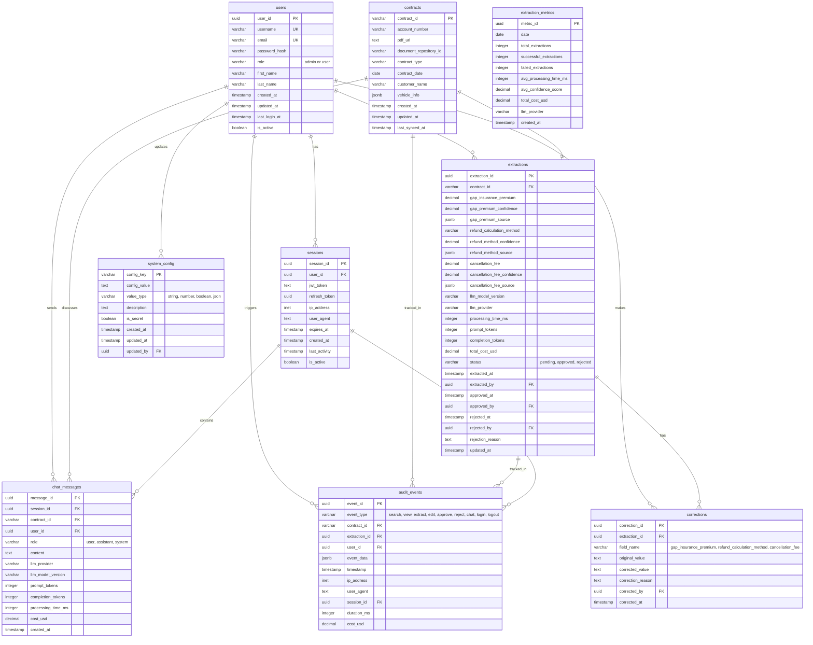

# Entity Relationship Diagram
## Contract Refund Eligibility System

This document contains the ER diagram for the database schema.

## Diagram

## Key Relationships

### 1. Users → Extractions (One-to-Many)
- A user can create multiple extractions
- Each extraction is created by one user
- Tracks who extracted the data from contracts

### 2. Users → Corrections (One-to-Many)
- A user can make multiple corrections
- Each correction is made by one user
- Tracks who corrected AI extraction errors

### 3. Contracts → Extractions (One-to-One)
- Each contract has exactly one extraction record
- Ensures no duplicate processing of the same contract
- Enforced by UNIQUE constraint on contract_id

### 4. Extractions → Corrections (One-to-Many)
- An extraction can have multiple corrections (one per field)
- Each correction belongs to one extraction
- Tracks all human corrections to AI data

### 5. Users → Sessions (One-to-Many)
- A user can have multiple active sessions (different devices)
- Each session belongs to one user
- Supports session management and JWT tokens

### 6. Users → Audit Events (One-to-Many)
- A user triggers many audit events
- Each event is associated with one user
- Immutable audit trail for compliance

### 7. Contracts → Audit Events (One-to-Many)
- A contract is referenced in multiple audit events
- Tracks all actions performed on a contract
- Complete history of contract interactions

### 8. Sessions → Chat Messages (One-to-Many)
- A session contains multiple chat messages
- Messages are grouped by session for context
- Supports conversation history

## Database Features

### Constraints
- **Primary Keys**: UUID for all entities (globally unique)
- **Foreign Keys**: Enforce referential integrity
- **Unique Constraints**: Prevent duplicate data (e.g., one extraction per contract)
- **Check Constraints**: Validate data ranges (e.g., confidence 0-100)

### Indexes
- **Single-column indexes**: Fast lookups on frequently queried columns
- **Partial indexes**: Optimized for common query patterns (e.g., recent events)
- **Composite indexes**: Support multi-column queries

### Triggers
- **updated_at triggers**: Auto-update timestamps on row changes
- **Immutability triggers**: Prevent modification of audit_events

### Views
- **v_extraction_details**: Complete extraction info with user details
- **v_user_activity**: Aggregated user statistics
- **v_daily_extraction_stats**: Daily performance metrics

## Data Flow

1. **User Login**
   - User authenticates → `users` table
   - Session created → `sessions` table
   - Login event logged → `audit_events` table

2. **Contract Search**
   - User searches by account number
   - System queries → `contracts` table
   - Search event logged → `audit_events` table

3. **AI Extraction**
   - LLM extracts data from PDF
   - Extraction stored → `extractions` table
   - Extract event logged → `audit_events` table

4. **Human Review**
   - User reviews extraction
   - If corrections needed → `corrections` table
   - Edit event logged → `audit_events` table

5. **Approval**
   - User approves extraction
   - Status updated → `extractions` table
   - Approve event logged → `audit_events` table

6. **Chat Interaction**
   - User asks question about contract
   - Messages stored → `chat_messages` table
   - Chat event logged → `audit_events` table

## Partitioning Strategy (Future)

After 6 months of operation, consider partitioning `audit_events` by month:
- Improves query performance on recent data
- Enables efficient archival of old data
- Supports 7-year retention requirement

## Backup and Retention

| Table | Retention | Backup Strategy |
|-------|-----------|-----------------|
| users | Indefinite | Daily incremental, weekly full |
| contracts | 7 years | Daily incremental, weekly full |
| extractions | 7 years | Daily incremental, weekly full |
| corrections | 7 years | Daily incremental, weekly full |
| audit_events | 7 years minimum | Daily incremental, monthly archive |
| sessions | 4 hours | Not backed up (ephemeral) |
| chat_messages | 1 year | Weekly full |
| extraction_metrics | 7 years | Monthly full |
